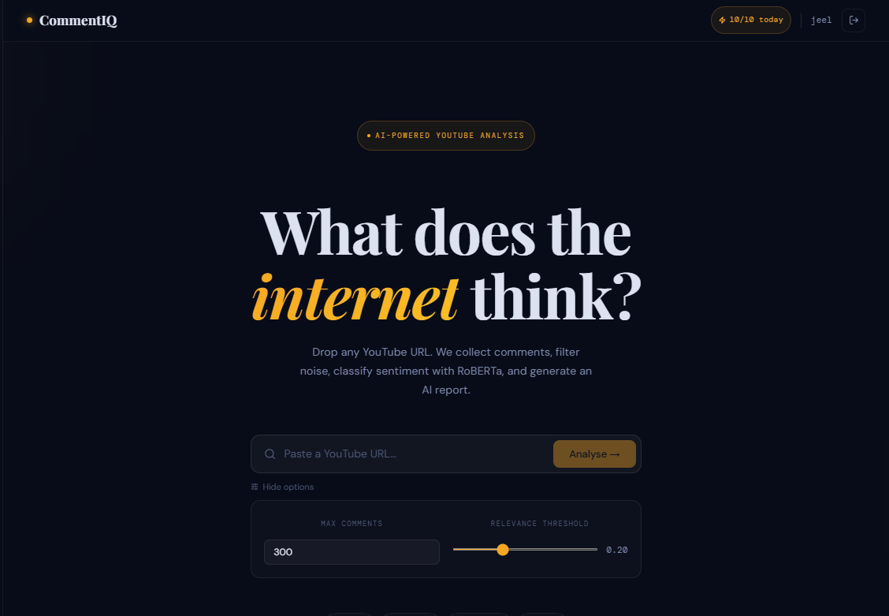
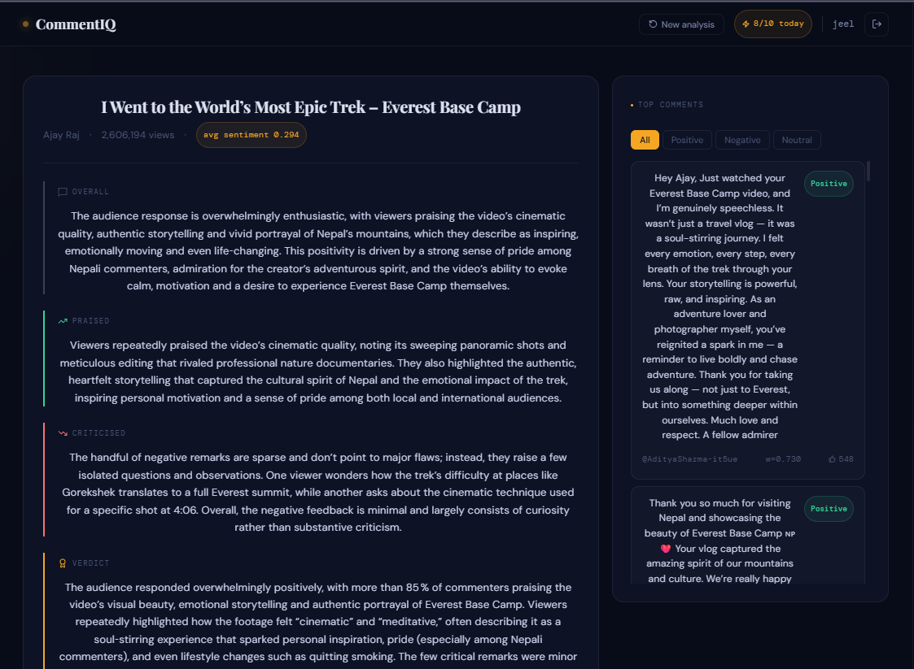
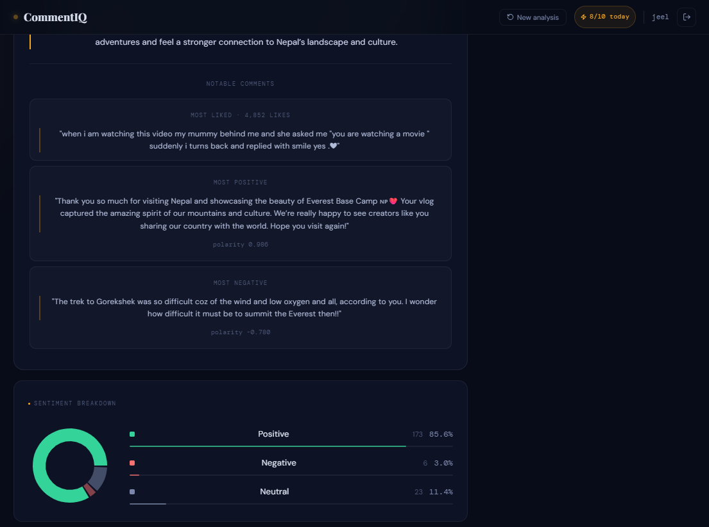

# CommentIQ

> AI-powered YouTube comment sentiment analysis pipeline

## 🖥️ Screenshots

| Home | Result 1 | Result 2 |
|------|-----------|-----------|
|  |  |  |

---

## What it does

CommentIQ takes any YouTube video URL and runs it through a 4-stage pipeline to understand how viewers actually feel about the content — not just what words they use.

1. **Collect** — Fetches comments via YouTube Data API v3 and generates a video summary using an LLM via OpenRouter (no transcript needed)
2. **Filter** — Embeds comments and the video summary using `sentence-transformers`, keeps only topically relevant ones via cosine similarity
3. **Analyse** — Classifies each comment using `SamLowe/roberta-base-go_emotions` (28 emotion labels mapped to positive / negative / neutral), with a Gen Z slang normalization layer and emoji-based override to handle internet language correctly
4. **Report** — Synthesises sentiment data into an AI-generated report: dominant emotions, what viewers praised, what they criticised, notable comments, and a final verdict

Results are cached by video ID — re-analysing the same video within 7 days returns instantly.

---

## Why go_emotions over standard sentiment models

Most sentiment models (including `twitter-roberta-base-sentiment`) were trained on text from 2018–2020 and misread modern internet language:

| Comment | Standard RoBERTa | CommentIQ |
|---|---|---|
| "first 5 secs killed me already" | 😟 Negative | 😍 Positive (amusement) |
| "holy shit Tenz is actually back" | 😟 Negative | 🤩 Positive (excitement) |
| "i'm dead 💀" | 😟 Negative | 😂 Positive (amusement) |
| "Whenever life hits hard I run to your videos ❤️" | 😟 Negative | 💚 Neutral→Positive (emoji override) |
| "this slaps hard" | 😐 Neutral | 👍 Positive (admiration) |
| "W video" | 😐 Neutral | 👍 Positive (approval) |

**Two layers of correction built in:**
- **Slang normalization** — 60+ patterns convert Gen Z terms to model-readable equivalents *before* inference (`"killed me"` → `"made me laugh so much"`, `"hits hard"` → `"is very impactful and moving"`)
- **Emoji override** — comments containing positive emojis (❤️ 😭 🥹 🥰 🔥 👑) that the model classifies as negative are bumped to neutral minimum — because 😭 in internet culture means overwhelmed with positive emotion, not sadness

---

## Tech stack

| Layer | Technology |
|---|---|
| Frontend | React + Vite |
| Backend | FastAPI + Uvicorn |
| Database | SQLite via aiosqlite |
| Auth | JWT + sha256_crypt (passlib) |
| Emotion model | `SamLowe/roberta-base-go_emotions` (28 labels) |
| Embedding model | `all-MiniLM-L6-v2` (sentence-transformers) |
| LLM | OpenRouter (any model) |
| Deployment | Docker Compose + Cloudflare Tunnel |

---

## Project structure

```
commentiq/
├── backend/
│   ├── main.py               # FastAPI app + all endpoints
│   ├── pipeline.py           # Async background job runner
│   ├── database.py           # SQLite layer (users, jobs, reports, cache)
│   ├── auth.py               # JWT authentication
│   ├── llm_client.py         # OpenRouter wrapper (shared by all stages)
│   ├── stage1_collect.py     # YouTube API + LLM video summary
│   ├── stage2_filter.py      # Cosine similarity relevance filter → CSV
│   ├── stage3_sentiment.py   # go_emotions classifier + slang + emoji override
│   ├── stage4_summarise.py   # AI report generation → JSON + MD
│   ├── requirements.txt
│   └── Dockerfile
├── frontend/
│   ├── src/
│   │   ├── App.jsx           # Main app shell + auth gate
│   │   ├── api.js            # All API calls with JWT auth headers
│   │   └── components/
│   │       ├── AuthPage.jsx        # Login / register
│   │       ├── UrlForm.jsx         # URL input + advanced options
│   │       ├── ProgressTracker.jsx # Live 4-stage progress
│   │       ├── SentimentChart.jsx  # Donut chart + legend
│   │       ├── CommentTable.jsx    # Filterable comment feed
│   │       └── ReportCard.jsx      # AI narrative + notable comments
│   ├── Dockerfile
│   ├── nginx.conf
│   └── vite.config.js
├── docker-compose.yml
├── .env.example
└── .gitignore
```

---

## Getting started

### Prerequisites

- Python 3.11+
- Node.js 20+
- Docker + Docker Compose (for containerised deployment)

### 1. Clone the repo

```bash
git clone https://github.com/JEELGANDHI21/CommentIQ.git
cd CommentIQ
```

### 2. Set up environment variables

```bash
cp .env.example .env
```

Edit `.env`:

```env
# YouTube Data API v3
YOUTUBE_API_KEY=your_key_here

# OpenRouter — LLM for summary + AI report
OPENROUTER_API_KEY=sk-or-your_key_here
OPENROUTER_MODEL=meta-llama/llama-3.3-70b-instruct

# JWT auth
SECRET_KEY=your_random_secret    # generate: openssl rand -hex 32
ACCESS_TOKEN_EXPIRE_MINUTES=1440

# Rate limiting
DAILY_REQUEST_LIMIT=10

# Cache
CACHE_TTL_DAYS=7
DB_PATH=commentiq.db
```

Get your keys:
- YouTube API → [console.cloud.google.com](https://console.cloud.google.com) → Enable **YouTube Data API v3**
- OpenRouter → [openrouter.ai/keys](https://openrouter.ai/keys) — free models available

### 3. Run locally

**Backend:**
```bash
cd backend
python -m venv .venv
.venv\Scripts\activate          # Windows
# source .venv/bin/activate     # Mac/Linux
pip install -r requirements.txt
uvicorn main:app --reload --port 8000
```

**Frontend:**
```bash
cd frontend
npm install
npm run dev
```

App runs at `http://localhost:5173`

> **First run:** `go_emotions` and `MiniLM` models (~500 MB each) download automatically and are cached for subsequent runs.

### 4. Run with Docker

```bash
docker compose up --build
```

App runs at `http://localhost:3000`

---

## Deployment with Cloudflare Tunnel

Expose your local app publicly for free — no server, no credit card.

```bash
# Download cloudflared from https://github.com/cloudflare/cloudflared/releases
# Run the tunnel (keep terminal open)
cloudflared tunnel --url http://localhost:5173
```

You'll get a URL like `https://xxxx.trycloudflare.com` — accessible from any device globally.

> **Note:** Add `allowedHosts: 'all'` to `vite.config.js` server config, otherwise Vite will block external hostnames.
> The URL changes on each restart. For a permanent URL, create a named tunnel with a free Cloudflare account.

---

## API reference

| Method | Endpoint | Auth | Description |
|---|---|---|---|
| `POST` | `/auth/register` | ❌ | Create account |
| `POST` | `/auth/login` | ❌ | Login → JWT token |
| `GET` | `/auth/me` | ✅ | Current user + usage |
| `GET` | `/auth/usage` | ✅ | Daily request usage stats |
| `POST` | `/analyse` | ✅ | Start pipeline job |
| `GET` | `/status/{job_id}` | ✅ | Poll job progress |
| `GET` | `/comments/{video_id}` | ✅ | Sentiment-enriched comments |
| `GET` | `/history` | ✅ | User's past 20 analyses |
| `GET` | `/videos/{video_id}/jobs` | ✅ | All jobs for a video |
| `GET` | `/health` | ❌ | Health check |

---

## Database schema

```sql
users         — auth + per-user daily rate limit (requests_today, daily_limit, last_reset_date)
jobs          — pipeline state by job_id + video_id (survives server restarts)
reports       — cached VideoReport JSON by video_id (TTL configurable)
comment_files — CSV paths for /comments endpoint lookup
```

---

## Output columns (sentiment CSV)

| Column | Description |
|---|---|
| `text` | Original comment text |
| `clean_text` | Slang-normalized, emoji-demojized text fed to model |
| `emotion` | Top go_emotions label (`amusement`, `joy`, `admiration`…) |
| `polarity` | Signed score −1 to +1 (derived from emotion + confidence) |
| `subjectivity` | Model confidence on top emotion label (0 to 1) |
| `sentiment` | `positive` / `negative` / `neutral` |
| `weighted_sentiment` | `polarity × relevance_score` — best overall signal |
| `relevance_score` | Cosine similarity vs. video summary (from Stage 2) |

---

## Features

- **go_emotions model** — 28 fine-grained emotion labels give richer signal than 3-label sentiment models
- **Gen Z slang normalization** — 60+ patterns fix language the model was never trained on
- **Emoji override** — positive emojis (❤️ 😭 🥹) prevent misclassification of emotional comments
- **Per-user rate limiting** — daily quota persisted in DB, resets at midnight UTC, per-user configurable
- **Report caching** — same video within TTL window returns instantly, no pipeline re-run
- **Job persistence** — all pipeline state in SQLite, survives server restarts
- **History endpoint** — users can see all past analyses with cache hit status

---

## Known limitations

- **Negation handling** — comments like *"not a comeback, he never fell to begin with"* may still be misclassified as negative. Negation in short informal text is an open NLP problem even for large models.
- **Transcript-free summary** — video summary is generated from title + description only (no transcript), so for videos with sparse descriptions the relevance filter may be less accurate.
- **In-memory model loading** — both ML models load into RAM on first request (~1 GB total). Free cloud tiers with <1 GB RAM will OOM during Stage 3.

---

## Environment variables

| Variable | Required | Default | Description |
|---|---|---|---|
| `YOUTUBE_API_KEY` | ✅ | — | YouTube Data API v3 key |
| `OPENROUTER_API_KEY` | ✅ | — | OpenRouter API key |
| `OPENROUTER_MODEL` | ❌ | `google/gemini-flash-1.5` | LLM model slug |
| `SECRET_KEY` | ✅ | — | JWT signing secret (`openssl rand -hex 32`) |
| `ACCESS_TOKEN_EXPIRE_MINUTES` | ❌ | `1440` | Token lifetime in minutes |
| `DAILY_REQUEST_LIMIT` | ❌ | `10` | Max pipeline runs per user per day |
| `DB_PATH` | ❌ | `commentiq.db` | SQLite file path |
| `CACHE_TTL_DAYS` | ❌ | `7` | Days before cached report expires |
| `VITE_API_TARGET` | ❌ | `http://localhost:8000` | Backend URL for Vite dev proxy |

---
